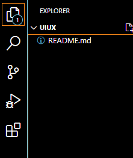
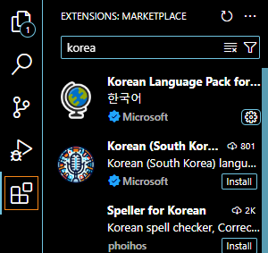
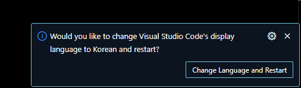
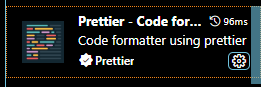
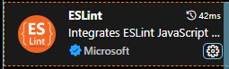
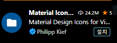
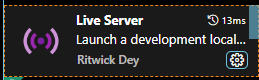
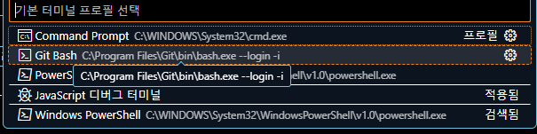
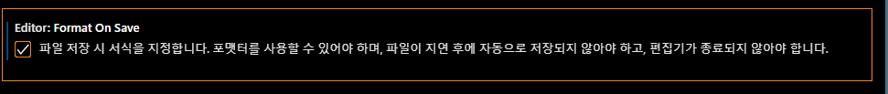

# VS Code 설치

- 검색창에 `vsCode` 를 입력하여 `Visual Studio Code` 를 찾아 다운로드 및 설치하기

## VS Code 실행하기

- 작업 폴더에서 마우스 우클릭하여 VS Code 실행하기

## VS Code 플러그인 설치하기

- 검색 창에 `Korea` 입력 : `Korean Language Pack` 설치

- 검색창에 `prettier` 입력 : `Prettier - Code formatter`

- 검색창에 `ESLint` 입력 : `ESLint` 설치

- 검색창에 `ICon` 입력 : Material Icon Theme 설치

- 검색창에 `Live` 입력 : Live Server 설치

## VS Code git bash 설정하기

- Ctrl + ` 를 눌러서 터미널을 연 뒤, 기본 프로필 선택 ㅡ git bash
  

## VS Code 세팅하기

- `Ctrl + ,` 를 눌러 세팅 실행하기
- Editor, Font Family : D2Coding 으로 변경하기

- formmatter 검색하여 `Prettier formatter`로 설정하기
  
  

- save 검색하여 `format on Save` 체크하기

